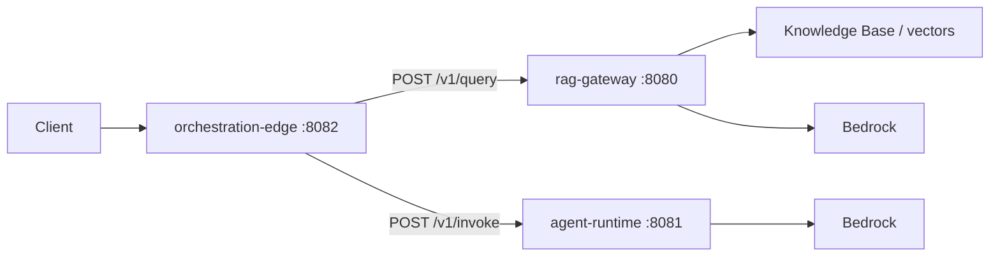

# Architecture

## Paths

1. **RAG gateway** — Retrieve relevant chunks (Knowledge Base / vector store), then generate with Bedrock. Optimized for **grounded factual** answers with citations.
2. **Agent runtime** — Isolated container on AgentCore for **tools**, longer sessions, and behavior that should not share the API process.

## Orchestration

**orchestration-edge** (port **8082**) is the HTTP entrypoint: it classifies the request and forwards the same JSON envelope to **rag-gateway** or **agent-runtime**. Routing rules and payloads are documented under `contracts/`. Sequential RAG-then-agent merges are not implemented yet.

## Failure domains

- RAG path: KB availability, embedding/retrieval latency, model quotas.
- Agent path: cold start, tool timeouts, session limits.

## Local ports (dev stubs)

| Service | Port | Notes |
|---------|------|--------|
| orchestration-edge | 8082 | Routes to RAG or agent |
| rag-gateway | 8080 | Spring Boot |
| agent-runtime | 8081 | Uvicorn in Dockerfile |

## Diagram

