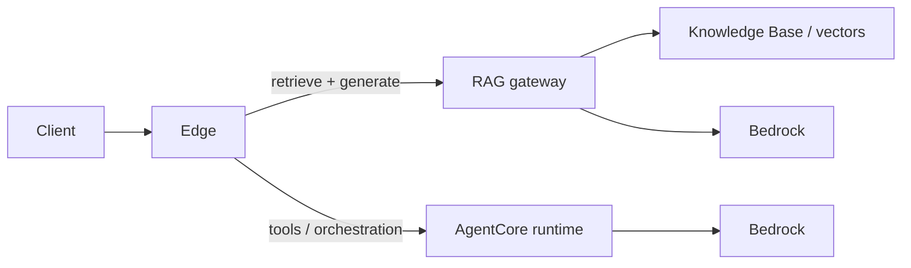

# Architecture

## Paths

1. **RAG gateway** — Retrieve relevant chunks (Knowledge Base / vector store), then generate with Bedrock. Optimized for **grounded factual** answers with citations.
2. **Agent runtime** — Isolated container on AgentCore for **tools**, longer sessions, and behavior that should not share the API process.

## Orchestration

The edge (gateway or BFF) classifies the user request and routes to one path, both in sequence (e.g. RAG then agent for formatting/actions), or merges structured outputs. Routing rules and envelopes live under `contracts/`.

## Failure domains

- RAG path: KB availability, embedding/retrieval latency, model quotas.
- Agent path: cold start, tool timeouts, session limits.

## Local ports (dev stubs)

| Service | Port | Notes |
|---------|------|--------|
| rag-gateway | 8080 | Spring Boot default |
| agent-runtime | 8081 | Uvicorn in Dockerfile |

## Diagram

